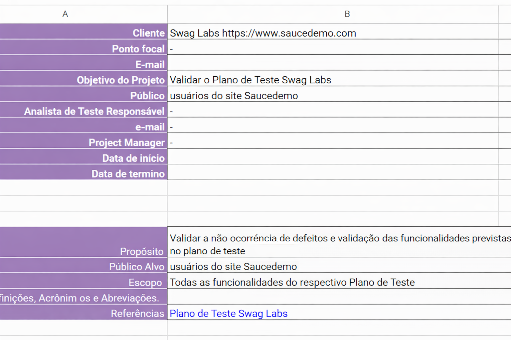

# Controle de Bugs

Este documento apresenta a estrutura utilizada para o **registro e gerenciamento de defeitos** identificados durante a execução dos testes na aplicação Swag Labs.

A planilha permite organizar, rastrear e acompanhar o status dos defeitos encontrados durante os testes.

---

## Plano de controle

A primeira aba da ferramenta contém as **informações de identificação do projeto**, incluindo contexto da aplicação testada e organização do controle de defeitos.

---

## Controle de Defeitos

Na aba **Controle de Bugs** são registrados todos os defeitos identificados durante a execução dos testes.

A planilha reúne informações importantes para análise e acompanhamento de cada defeito.

---

## Campos utilizados no registro de defeitos

### Defeito

Título breve e objetivo que identifica o problema encontrado.

---

### Descrição

Descrição detalhada do defeito identificado.

Para facilitar o entendimento e a reprodução do problema, a descrição utiliza **linguagem Gherkin**, apresentando o passo a passo que levou à identificação do defeito.

---

### Story

Indica a funcionalidade relacionada ao defeito, juntamente com o **ID do Caso de Teste (CT)** associado.

---

### Prioridade

Define a **ordem de correção do defeito**, considerando a urgência e impacto para o negócio.

---

### Severidade

Indica o impacto do defeito no funcionamento do sistema.

A severidade avalia o nível de comprometimento da funcionalidade e como o problema afeta o uso da aplicação.

---

### Time responsável

Indica o time ou área responsável pela correção do defeito identificado.

---

### Indicador de Status

Campo visual utilizado para indicar o status atual do defeito registrado.

Exemplo de status:

- Aberto
- Em análise
- Em correção
- Resolvido
- Reaberto

---

## Observação

Esta planilha foi disponibilizada pela instrutora **Priscila de Araujo Caimi**, da plataforma **Qualiters Club**, durante o curso de **Planejamento e Execução de Testes**.